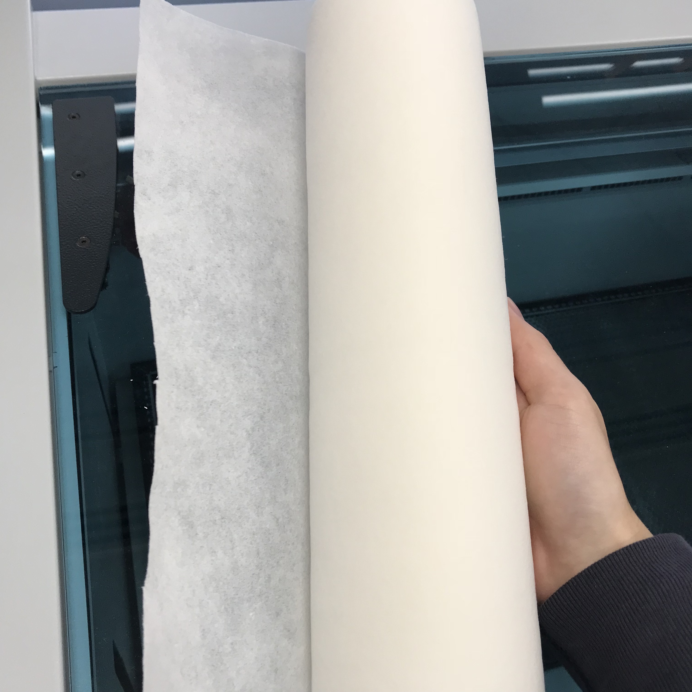
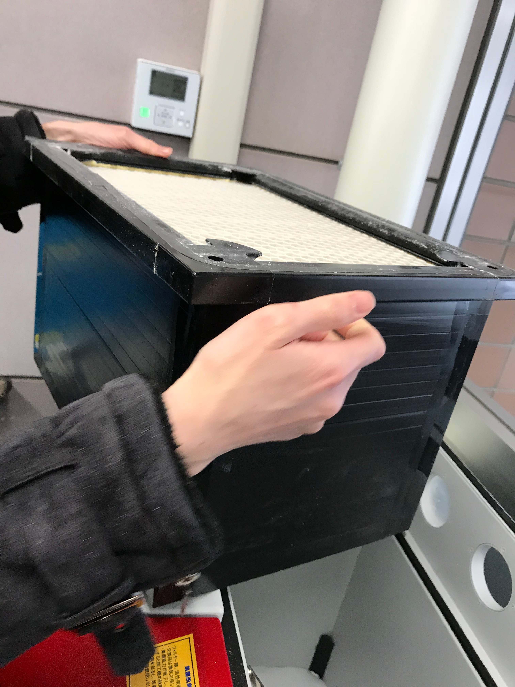

# Aizu Geek Dojo レーザーカッターメンテナンス（フィルター集塵機）

## 目次

- 1.	ロールフィルター
- 2.	プレフィルター
- 3.	活性炭

### 1. ロールフィルター
集塵機1枚目のフィルター。毎週水曜日交換。  
マニュアル8.1参照  
1. 電源が切れていることを確認する  
2. 六角レンチを使って二箇所外す  
3. 蓋を開ける  
4. ホースを抜く。ホースに粉が付いているのでフレームの上で落とす  
5. ホースを落とさないように傍に乗せる  
6. フレームを外す
7. シートを取り外し、粉が落ちないように畳む。  
8. シートを長めに切り、四角を折って挟む  

9. フレーム、ホースを戻す  
10. 六角レンチを使い、蓋を締め終了  

### 2. プレフィルター
ロールフィルターの下に敷いてあるフィルター。三ヶ月に一回メンテナンス
1. ロールフィルター同様の手順で外し、外で叩いてください  

### 3. 活性炭
プレフィルターの下にある、フィルターユニットの下にある炭。三ヶ月に一回メンテナンス  
1. プレフィルターまで上と同様の手順で外す  
2. フィルターユニットを外す

3. 炭があるので、中をかき混ぜる  

4. フィルターユニット、プレフィルター、ロールフィルター、を同様の手順で戻す  
