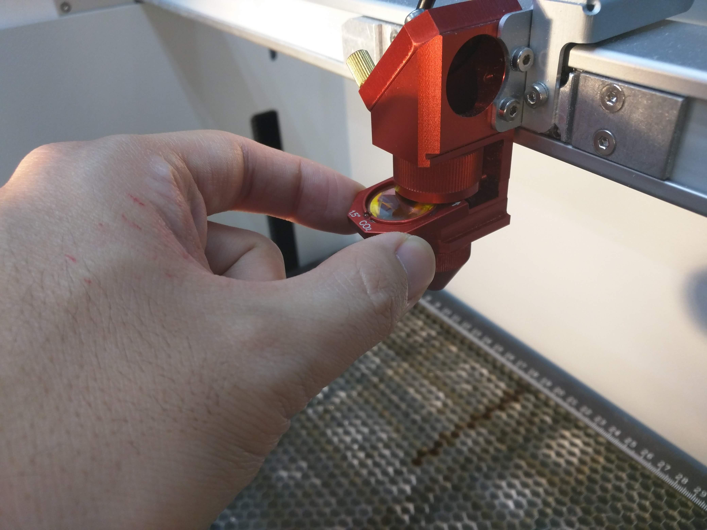
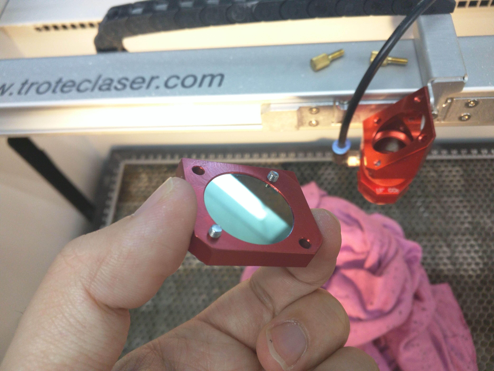
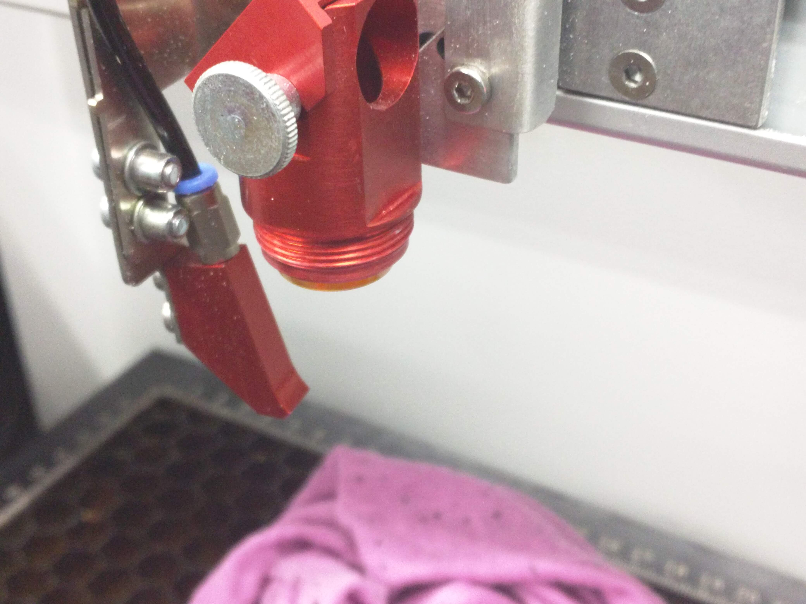
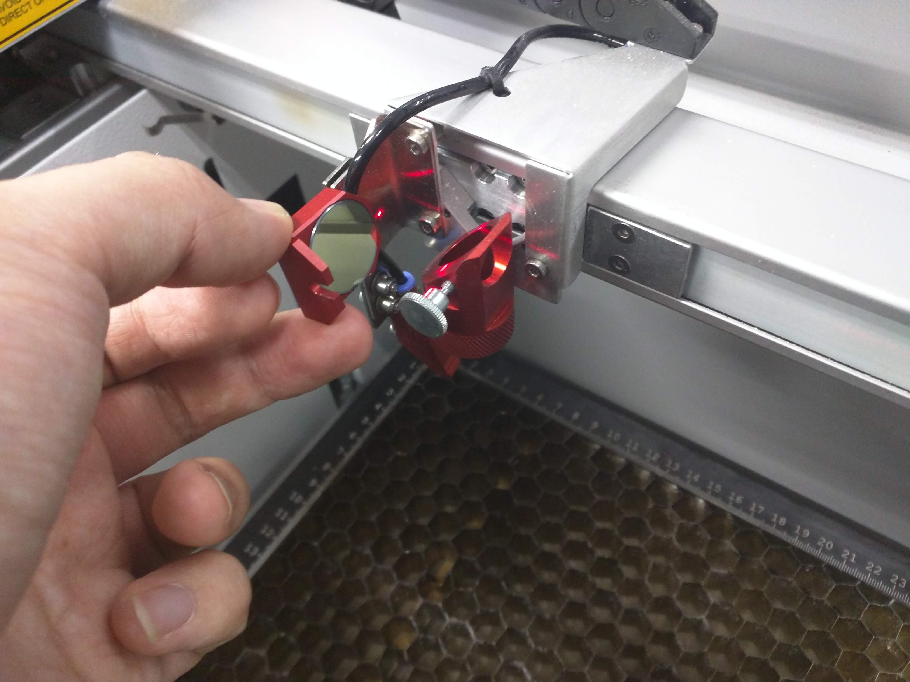
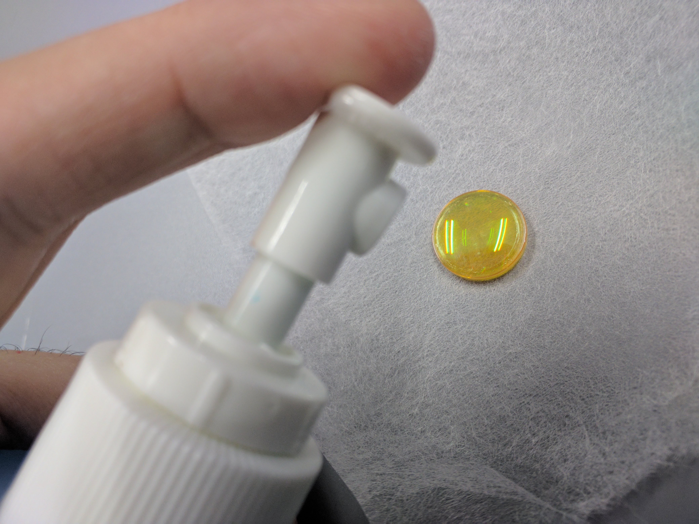
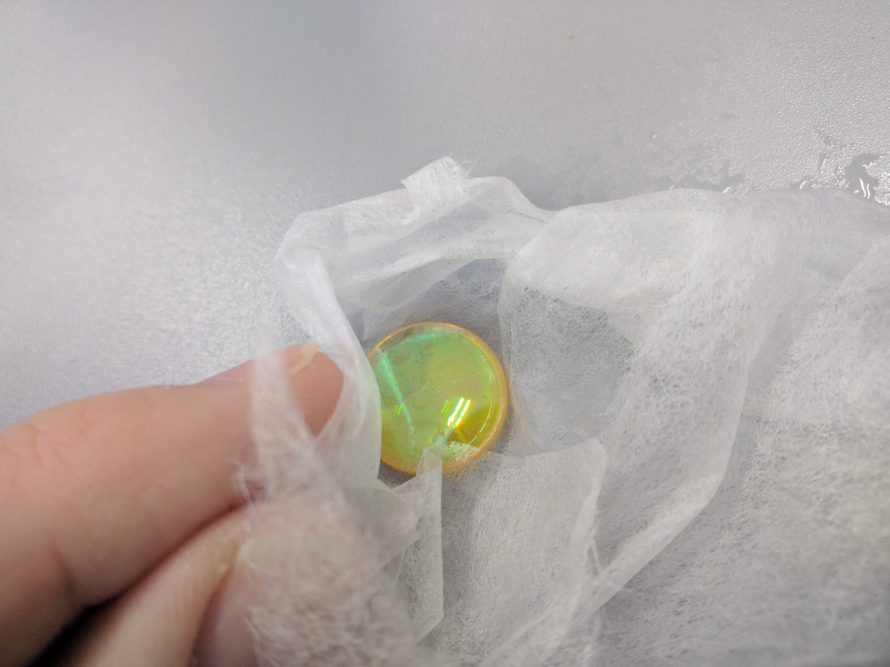
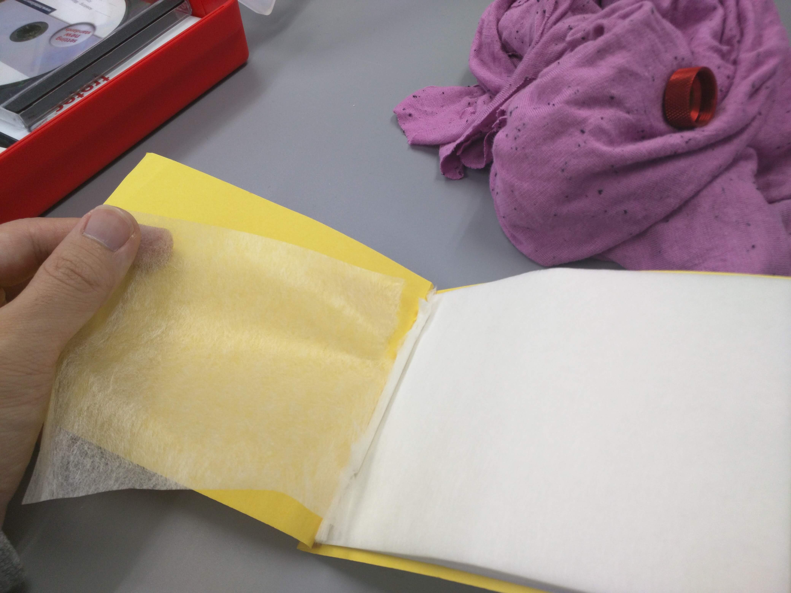
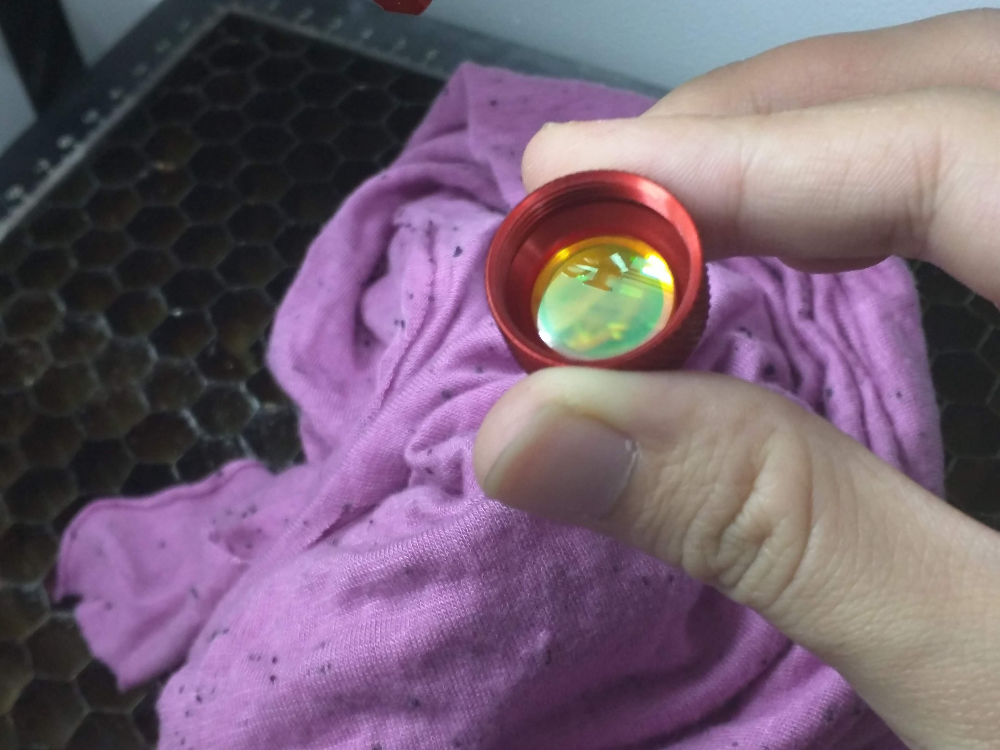

# Aizu Geek Dojo レーザーカッターメンテナンス（レンズ・ミラー清掃）
 
#### レンズ・ミラー掃除の流れ  
- レンズ・ミラーを外します  
機種によって外し方が違うので注意してください
- レンズ・ミラーを掃除します  
クリーニング液を使ってこすらず慎重に
掃除してください
 
### 1. レンズ・ミラーの外し方

作業を行う前に、万一の落下にそなえ、必ずやわらかい布など敷いてください。

#### Speedy 300の場合
ミラーは中央部分と上部の２箇所にあります。

中央のレンズを外してみましょう。
中央ミラーの上にある円状の部品を回し、スライドさせて外します。

上部のミラーを外してみましょう。
上部の金色のネジを回して外すと、簡単に外れます。

#### Speedy 100の場合
ミラーは下部と上部の２箇所にあります。

下部のレンズを外してみましょう。
下部にある円状の部品を回すと外れます。
レンズが先端について落ちてこない場合は、回す際レンズの角にやさしく当てて外してください。

上部のミラーを外してみましょう。
横のネジのを回して外すと、簡単に外れます。

### ２. レンズ・ミラーの掃除方法
レンズは、直接こすって拭くのではなく、クリーニング液を垂らし、
それを取ることによって掃除してください。
 
レンズクリーニング液をレンズに数滴垂らします。

軽く揺らして汚れを浮かせたあと、紙に吸い取らせるようにしてクリーニング液を拭き取ります。

拭きとるときは専用のペーパータオルを使ってください。キムワイプは使用しないでください。

同様の方法で、その他のレンズやミラーも清掃をおこなってください。

#### Speedy 100のレンズ取り付け向きについて
Speedy 100の下部レンズは、鏡のように映る向きを上にして取り付けてください。角度を変えて自分の顔が映れば、それが上面です。

